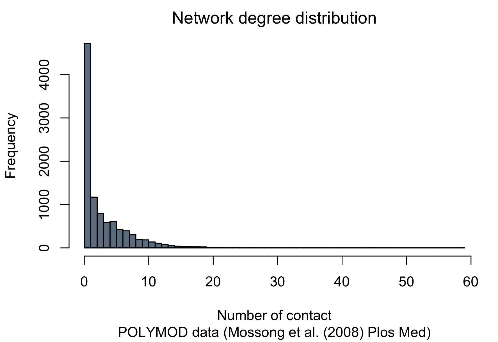
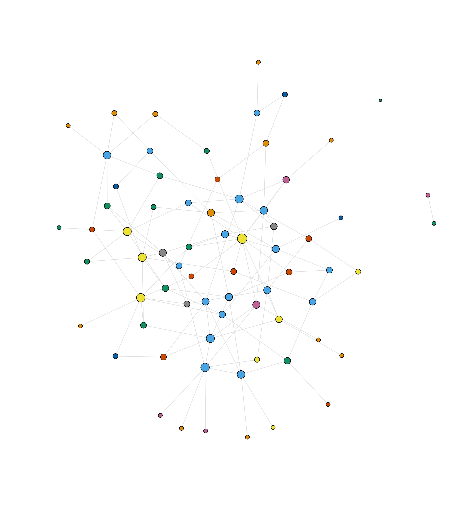
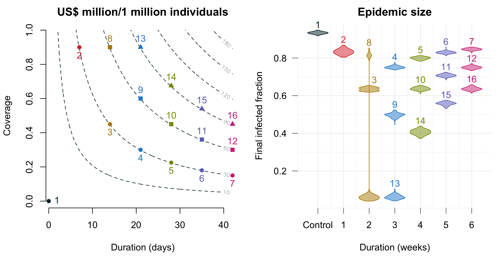

Supplemental simulation code for the paper [link to bioarix] 


Table of Contents
=================

* [Load settings and functions](#load-settings-and-functions)
* [Network generation](#network-generation)
  * [Network degree distribution](#network-degree-distribution)
  * [An example network with 70 nodes](#an-example-network-with-70-nodes)
* [Parallel without cluster version](#parallel-without-cluster-version)
* [Scenarios](#scenarios)
* [Outputs processing](#outputs-processing)
  * [Simulation results](#simulation-results)

# Load settings and functions

```R
source("./code/helpers.R")
source("./code/ModelandParams.R")
source("./code/genNet.R")
source("./code/networkSim.R")
pop <- 10^4
```
# Network generation
```R
# -------------------------------------------------------------------------
# (not run), run once and load from RData instead
# -------------------------------------------------------------------------
# M <- genNet(10000, 123, nAllunique, pAll)
M = readRDS("./data/M.Rds")
hist(degree(M$g), breaks=50, main="Network degree distribution", xlab="Number of contact", col="slategrey", sub="POLYMOD data (Mossong et al. (2008) Plos Med)")
# savePNG("./fig/degree")
```

## Network degree distribution


## An example network with 70 nodes



# Parallel without cluster version

```R
runcon <- function(namex="control", pvaci=0, ssize=1:1000) {
  dir.create(paste0("./out/", namex), recursive = TRUE)
  ncores <- detectCores()
  loopF  <- function(x) {
    out  <- antivir(ni0=100, pvac=pvaci)
    dput(out, paste0("./out/", namex, "/", pvaci*100, "_", x) )
  }
  system.time(mclapply(ssize, loopF, mc.cores=ncores))
}
```
# Scenarios

```R
# -------------------------------------------------------------------------
# Long computation process
# -------------------------------------------------------------------------
# Control no vaccination --------------------------------------------------
  runcon()
# 1 weeks .9 coverage -----------------------------------------------------
  totalDrug <- 7*300*.9*10000
  # Generating D dynamics
  x1  <- c(D = 0); .t  <- seq(0, 365, .01)
  o1  <- ode(x1, .t, drug, pars, events=list(data=ij(0, .5, 7, 150)))
  # Put into a light form, change for every scenario
  fD  <- approxfun(o1[, "time"], o1[, "D"], rule=2)
  runcon("1week90", 0.9, 1:100)
# 2 weeks .45 coverage ----------------------------------------------------
  (totalDrug/(14*300))/10000
  o1  <- ode(x1, .t, drug, pars, events=list(data=ij(0, .5, 14, 150)))
  fD  <- approxfun(o1[, "time"], o1[, "D"], rule=2)
  runcon("2week45", 0.45, 1:100)
# 3 weeks .30 coverage ----------------------------------------------------
  (totalDrug/(21*300))/10000
  o1  <- ode(x1, .t, drug, pars, events=list(data=ij(0, .5, 21, 150)))
  fD  <- approxfun(o1[, "time"], o1[, "D"], rule=2)
  runcon("3week30", 0.3, 1:100)
# 4 weeks .225 coverage ---------------------------------------------------
  (totalDrug/(28*300))/10000
  o1  <- ode(x1, .t, drug, pars, events=list(data=ij(0, .5, 28, 150)))
  fD  <- approxfun(o1[, "time"], o1[, "D"], rule=2)
  runcon("4week225", .225, 1:100)
# 5 weeks .18 coverage ----------------------------------------------------
  (totalDrug/(35*300))/10000
  o1  <- ode(x1, .t, drug, pars, events=list(data=ij(0, .5, 35, 150)))
  fD  <- approxfun(o1[, "time"], o1[, "D"], rule=2)
  runcon("5week18", .18, 1:100)
# 6 weeks .15 coverage ----------------------------------------------------
  (totalDrug/(42*300))/10000
  o1  <- ode(x1, .t, drug, pars, events=list(data=ij(0, .5, 42, 150)))
  fD  <- approxfun(o1[, "time"], o1[, "D"], rule=2)
  runcon("6week15", 0.15, 1:100)

# Doubling the investment from 30 mil to 60 mil/mil individuals

# 2 weeks .90 coverage ----------------------------------------------------
  # (totalDrug/(14*300))/10000
  totalDrug <- 14*300*.9*10000
  o1  <- ode(x1, .t, drug, pars, events=list(data=ij(0, .5, 14, 150)))
  fD  <- approxfun(o1[, "time"], o1[, "D"], rule=2)
  runcon("2week90", 0.90, 1:100)
# 3 weeks .60 coverage ----------------------------------------------------
  cvr <- (totalDrug/(21*300))/10000
  o1  <- ode(x1, .t, drug, pars, events=list(data=ij(0, .5, 21, 150)))
  fD  <- approxfun(o1[, "time"], o1[, "D"], rule=2)
  runcon("3week60", cvr, 1:100)
# 4 weeks .45 coverage ---------------------------------------------------
  cvr <- (totalDrug/(28*300))/10000
  o1  <- ode(x1, .t, drug, pars, events=list(data=ij(0, .5, 28, 150)))
  fD  <- approxfun(o1[, "time"], o1[, "D"], rule=2)
  runcon("4week45", cvr, 1:100)
# 5 weeks .36 coverage ----------------------------------------------------
  cvr <- (totalDrug/(35*300))/10000
  o1  <- ode(x1, .t, drug, pars, events=list(data=ij(0, .5, 35, 150)))
  fD  <- approxfun(o1[, "time"], o1[, "D"], rule=2)
  runcon("5week36", cvr, 1:100)
# 6 weeks .30 coverage ----------------------------------------------------
  cvr <- (totalDrug/(42*300))/10000
  o1  <- ode(x1, .t, drug, pars, events=list(data=ij(0, .5, 42, 150)))
  fD  <- approxfun(o1[, "time"], o1[, "D"], rule=2)
  runcon("6week30", cvr, 1:100)

# Triple the investment from 30 mil to 90 mil/mil individuals
# 3 weeks .90 coverage ----------------------------------------------------
  totalDrug <- 21*300*0.90*10000
  o1  <- ode(x1, .t, drug, pars, events=list(data=ij(0, .5, 21, 150)))
  fD  <- approxfun(o1[, "time"], o1[, "D"], rule=2)
  runcon("3week90", 0.90, 1:100)
# 4 weeks .675 coverage ---------------------------------------------------
  cvr <- (totalDrug/(28*300))/10000
  o1  <- ode(x1, .t, drug, pars, events=list(data=ij(0, .5, 28, 150)))
  fD  <- approxfun(o1[, "time"], o1[, "D"], rule=2)
  runcon("4week675", cvr, 1:100)
# 5 weeks .54 coverage ----------------------------------------------------
  cvr <- (totalDrug/(35*300))/10000
  o1  <- ode(x1, .t, drug, pars, events=list(data=ij(0, .5, 35, 150)))
  fD  <- approxfun(o1[, "time"], o1[, "D"], rule=2)
  runcon("5week54", cvr, 1:100)
# 6 weeks .45 coverage ----------------------------------------------------
  cvr <- (totalDrug/(42*300))/10000
  o1  <- ode(x1, .t, drug, pars, events=list(data=ij(0, .5, 42, 150)))
  fD  <- approxfun(o1[, "time"], o1[, "D"], rule=2)
  runcon("6week45", cvr, 1:100)
closeAllConnections()
```

# Outputs processing

```R
# Extract zip
# -------------------------------------------------------------------------
system("tar xzvf out.zip")
# Example of epidemic trajectory
# -------------------------------------------------------------------------

ex1 <- dget("./out/5week18/18_69")
plotSIR(ex1, endTime=30)

# Read simulation outputs
# -------------------------------------------------------------------------
controlIC  <- processIC("./out/control")
aweek90IC  <- processIC("./out/1week90")
zweek45IC  <- processIC("./out/2week45")
zweek90IC  <- processIC("./out/2week90")
dweek30IC  <- processIC("./out/3week30")
dweek60IC  <- processIC("./out/3week60")
dweek90IC  <- processIC("./out/3week90")
fweek225IC <- processIC("./out/4week225")
fweek45IC  <- processIC("./out/4week45")
fweek675IC <- processIC("./out/4week675")
fweek18IC  <- processIC("./out/5week18")
fweek36IC  <- processIC("./out/5week36")
fweek54IC  <- processIC("./out/5week54")
sweek15IC  <- processIC("./out/6week15")
sweek30IC  <- processIC("./out/6week30")
sweek45IC  <- processIC("./out/6week45")

fpc <- function(x) unlist(x)/pop
tmp <- list(fpc(controlIC), fpc(aweek90IC), fpc(zweek45IC), fpc(zweek90IC), fpc(dweek30IC), fpc(dweek60IC), fpc(dweek90IC), fpc(fweek225IC), fpc(fweek45IC), fpc(fweek675IC), fpc(fweek18IC), fpc(fweek36IC), fpc(fweek54IC), fpc(sweek15IC), fpc(sweek30IC), fpc(sweek45IC))

# Drug coverage 
# -------------------------------------------------------------------------
minperMg = 12/(10*75)
dx <- seq(1, 42, 0.1)
dy <- seq(0, 1, length.out=length(dx))
md <- matrix(NA, length(dx), length(dx))
md[, 1:length(dx)] <- dx
md <- sweep(md, MARGIN=2, dy*300*minperMg, `*`)
markx <- which(dx %in% seq(1, 42, 10))
marky <- which(dy %in% seq(0, 1, .1))

# Plotting
# -------------------------------------------------------------------------
dev.new(width=9, height=4.74)
put(1,2)
fy <- function(x, y) c(((x*300*.9*pop)/(7*(y:6)*300))/pop)
contour(x=dx, y=dy, md, bty="n", axes=T, xlab = "Duration (days)", ylab = "Coverage", levels = c(10, 30, 60, 90, 120, 150, 180), col=1, lty=2, main="US$ million/1 million individuals")
points(0, 0, pch=16, col=1, xpd=1)
text(0, 0, pos=4, col=1, xpd=1, label=1)
points(7*1:6, fy(7, 1), pch=16, col=2:7, xpd=1)
text(7*1:6, fy(7, 1), pos=1, col=2:7, xpd=1, label=2:7)
points(7*2:6, fy(14, 2), pch=15, col=3:7, xpd=1)
text(7*2:6, fy(14, 2), pos=3, col=3:7, xpd=1, label=8:12)
points(7*3:6, fy(21, 3), pch=17, col=4:7, xpd=1)
text(7*3:6, fy(21, 3), pos=3, col=4:7, xpd=1, label=13:16)
cols <- c(1:3, 3, rep(4:7, each=3))
kiolin(tmp, at=cols, names=c("Control", 1:6), method="sj", col=AddAlpha(cols), border=cols, pchMed=16, drawRect=0, xlab="Duration (weeks)", ylab="Final infected fraction", main="Epidemic size")
text(replace(cols, 3, 3.2), sapply(tmp, max)+.03, label=c(1,2,3,8,4,9,13,5,10,14,6,11,15,7,12,16), xpd=1, col=cols)
savePs("2panes")
```

## Simulation results

